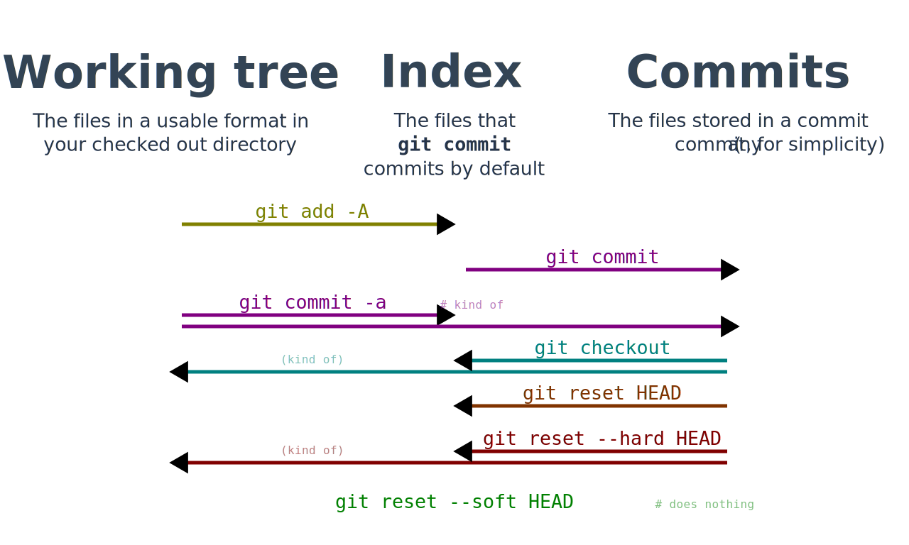

---
# https://marpit.marp.app/directives
marp: true

paginate: true
theme: uncover
style: |
  /* https://github.com/marp-team/marp-core/blob/main/themes/uncover.scss */
  :root {
    --color-background: #ddd;
    --color-background-code: #ccc;
    --color-background-paginate: #dadada;
    --color-foreground: #345;
    --color-highlight: #9ac;
    --color-highlight-hover: #aaf;
    --color-highlight-heading: #9ac;
    --color-header: #bbb;
    --color-header-shadow: transparent;
  }
  section:has(:not(h1,h2,h3,h4,h5,h6)) {
    text-align: left;
  }
  
  /* Make first headings left-aligned.
   * Taken from (with some generalisations):
   * https://github.com/orgs/marp-team/discussions/478#discussioncomment-7179321
   */
  section:has(> :not(h1,h2,h3,h4,h5,h6)) > :first-child {
    flex: 1 0 auto;
    padding: 0;
    margin: 0;
    order: -999999;
  }
  section:has(> :not(h1,h2,h3,h4,h5,h6))::before {
    flex: 1 0 auto;
    display: block;
    content: '';
    order: 999999;
  }

  h2, h3, h4, h5, h6 {
    opacity: .9;
  }

  ul, li {
    text-align: left;
    margin-left: 0;
  }

  .spoiler:not(:hover) {
    color: var(--color-foreground);
    background-color: var(--color-foreground);
  }
---
# Git Fundamentals
### What are Git objects?

---
## What's the index?
## What's the working tree?

---


---
## What are Git objects?

<br/>

---
## What are Git objects?

They're files.

<br/><br/><br/><br/><br/><br/><br/>

---
### Where are Git objects located?

---
### Where are Git objects located?

They're in the `.git` directory.

```
.git/
  objects/💁‍♂️
  ...
app/
build.sbt
```

---
## Demo time!

---
### Demo time! (Prerequisites)

Install the `tree` command:
```bash
brew install tree
```
Useful for visualising directory trees in one go.

---
### Demo time! (Step 1)

Create a fresh repo:
```bash
rm -r my-test-repo;
git init my-test-repo;
cd my-test-repo;
```
Output:
```text
hint: Using 'master' as the name for the initial branch. This default branch name
hint: is subject to change. To configure the initial branch name to use in all
hint: of your new repositories, which will suppress this warning, call:
hint: 
hint:   git config --global init.defaultBranch <name>
hint: 
hint: Names commonly chosen instead of 'master' are 'main', 'trunk' and
hint: 'development'. The just-created branch can be renamed via this command:
hint: 
hint:   git branch -m <name>
Initialized empty Git repository in /Users/dan.silaghimercator.group/fs/proj/local/git-fundamentals-marp/my-test-repo/.git/
```

---
### Demo time! (Step 2)
⚠️ In a terminal window you won't use for work ⚠️,
set the following environment variables:
```bash
export GIT_AUTHOR_NAME='Author';
export GIT_AUTHOR_EMAIL='some@email';
export GIT_COMMITTER_NAME='Author';
export GIT_COMMITTER_EMAIL='some@email';

export GIT_AUTHOR_DATE='2005-04-07T22:13:13+0000';
export GIT_COMMITTER_DATE='2005-04-07T22:13:13+0000';

export PS1="GIT DEMO ONLY: %1~ $ "; # To give you a warning in the terminal prompt.
```
This will force all commits to have the same dates/email.

---
### Demo time! (Step 3)
Install the `tree` command:
```
brew install tree
```

It's useful for visualising directory trees.

---
### Demo time! (Step 3)

We're in a fresh repo, so no commits yet!

Run:
```bash
git status;
```
Output:
```text
On branch master

No commits yet

nothing to commit (create/copy files and use "git add" to track)
```

---
### Demo time! (Step 4)
Let's check the objects. Run:
```bash
tree .git/objects
```
Outputs:
```text
.git/objects
├── info
└── pack

3 directories, 0 files
```
No objects yet. 😔 
Those are empty directories, which we'll ignore.

---
### Demo time! (Step 5)

So let's create a file.
```bash
touch my-file

tree .git/objects
```
```
.git/objects
├── info
└── pack

3 directories, 0 files
```
No objects yet. Why?
<span class="spoiler">Because the index is empty and there are no commits!</span>

---
### Demo time! (Step 6)
Add the new file to the index.
```bash
git add my-file

tree .git/objects
```
```
.git/objects
├── e6
│   └── 9de29bb2d1d6434b8b29ae775ad8c2e48c5391
├── info
└── pack

4 directories, 1 file
```
---
### Demo time! (Step 7)
Commit the file.
```bash
git commit -m "Initial file."

tree .git/objects
```
```
.git/objects
├── 52
│   └── 82521d8ce09f66ba9cbab0f5eabf23ad31f569
├── d7
│   └── 6cef36d5ead14b2d0dada0de011d90f75ba760
├── e6
│   └── 9de29bb2d1d6434b8b29ae775ad8c2e48c5391
├── info
└── pack
```

---
## Demo over!

---
### Git objects
As you add files and make commits, new files keep appearing in `.git/objects`.